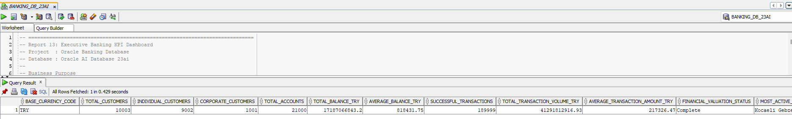
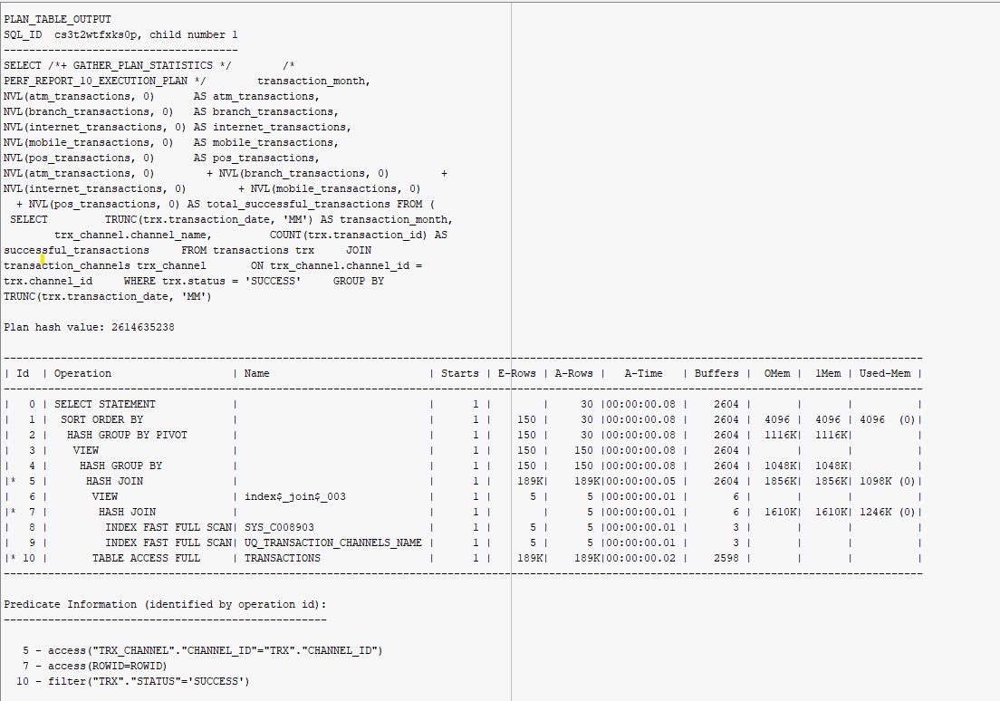

# Project Images

This directory contains screenshots used as visual evidence for the **Oracle Banking Database** project.

The images support selected SQL reporting and performance-analysis sections. They are supplementary documentation; the source SQL and technical analysis remain the authoritative project artifacts.

## Structure

```text
09_Images/
├── 01_SQL_Reports/
├── 02_Performance/
└── README.md
```

## SQL Report Images

`01_SQL_Reports` contains screenshots for selected advanced reporting outputs:

| Image | Related Report |
|---|---|
| `branch_transaction_performance_rollup.png` | Branch transaction performance with `ROLLUP` |
| `transaction_type_channel_analysis_grouping_sets.png` | Transaction type and channel analysis with `GROUPING SETS` |
| `executive_banking_kpi_dashboard_01.png` | Executive banking KPI dashboard |
| `executive_banking_kpi_dashboard_02.png` | Executive banking KPI dashboard |
| `branch_portfolio_transaction_kpi_01.png` | Branch portfolio and transaction KPI dashboard |
| `branch_portfolio_transaction_kpi_02.png` | Branch portfolio and transaction KPI dashboard |
| `branch_portfolio_transaction_kpi_03.png` | Branch portfolio and transaction KPI dashboard |
| `customer_360_portfolio_dashboard_01.png` | Customer 360 portfolio dashboard |
| `customer_360_portfolio_dashboard_02.png` | Customer 360 portfolio dashboard |
| `customer_360_portfolio_dashboard_03.png` | Customer 360 portfolio dashboard |

Example:



## Performance Images

`02_Performance` contains screenshots supporting performance-analysis documentation:

| Image Group | Purpose |
|---|---|
| `table_volume_baseline.png` | Table-volume baseline |
| `execution_plan_analysis.png` | Execution-plan analysis |
| `index_analysis_01.png` - `index_analysis_04.png` | Index-analysis evidence |
| `plsql_performance_review_01.png` - `plsql_performance_review_06.png` | PL/SQL performance-review evidence |

Example:



## Related Modules

- `03_SQL_Reports` - Analytical SQL source files
- `05_Performance` - Execution plans, index analysis, SQL tuning, and PL/SQL performance review

Screenshots are retained as supporting evidence only; conclusions should be based on the corresponding source files and documented analysis.