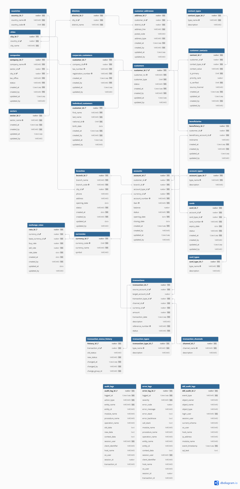

# Oracle Banking Database

A portfolio-scale Oracle banking database project covering relational database design, controlled data deployment, analytical SQL reporting, PL/SQL development, performance analysis, testing, database administration, documentation, and troubleshooting.

The repository combines an application-development environment based on **Oracle AI Database 26ai** with a separate **Oracle Database 19c DBA laboratory**.

## Project Highlights

- 26-table normalized banking schema
- 200,000 transaction dataset
- 15 analytical SQL reports
- 9 PL/SQL packages with separate specifications and bodies
- 7 database triggers
- Execution-plan, index, SQL tuning, and PL/SQL performance reviews
- Schema, data-integrity, SQL-report, PL/SQL, integration, and regression testing
- Oracle 19c DBA modules for storage, backup, RMAN, recovery, Data Pump, maintenance, monitoring, and performance
- Documented troubleshooting cases for SQL Developer CTE parsing and Data Pump `ORA-39405`

## Environments

### Application Development

```text
Operating System : Windows 11
Database         : Oracle AI Database 26ai Enterprise Edition
Version          : 23.26.1.0.0
Service / PDB    : ORCLPDB1
Schema           : BANKING_DB
Docker Container : oracle_ee_23ai
Docker Image     : container-registry.oracle.com/database/enterprise:23.26.1.0
SQL Client       : Oracle SQL Developer 24.3.1.347
```

This environment is used for database design, Data Pump dataset creation, SQL reporting, PL/SQL development, performance analysis, and testing.

### DBA Laboratory

```text
Operating System : Oracle Linux 8.10
Database         : Oracle Database 19c Enterprise Edition
Database Name    : ORCL
Architecture     : Non-CDB
Log Mode         : ARCHIVELOG
Tooling          : SQLcl / RMAN
Execution        : SYSDBA
```

This environment is used for Oracle DBA administration and operational practice.

## Repository Structure

```text
Oracle-Banking-Database/
├── 01_Database_Design/
├── 02_Data_Deployment/
├── 03_SQL_Reports/
├── 04_PLSQL/
├── 05_Performance/
├── 06_Testing/
├── 07_DBA/
├── 08_Documentation/
├── 09_Images/
├── 10_Troubleshooting/
└── README.md
```

| Module | Purpose |
|---|---|
| [`01_Database_Design`](01_Database_Design/) | ERD, tables, constraints, indexes, sequences, and view inventory |
| [`02_Data_Deployment`](02_Data_Deployment/) | Verified Data Pump export/import workflow and dataset integrity checks |
| [`03_SQL_Reports`](03_SQL_Reports/) | 15 analytical and executive SQL reports |
| [`04_PLSQL`](04_PLSQL/) | Business packages, logging infrastructure, and triggers |
| [`05_Performance`](05_Performance/) | Baselines, execution plans, index analysis, SQL tuning, and PL/SQL performance review |
| [`06_Testing`](06_Testing/) | Schema, integrity, reporting, PL/SQL, integration, and regression testing |
| [`07_DBA`](07_DBA/) | Oracle 19c administration, backup, RMAN, recovery, maintenance, monitoring, and performance |
| [`08_Documentation`](08_Documentation/) | Architecture, database object inventory, and environment documentation |
| [`09_Images`](09_Images/) | Supporting SQL-report and performance screenshots |
| [`10_Troubleshooting`](10_Troubleshooting/) | Documented technical issues and resolutions |

## Database Design

The validated structural inventory includes:

| Object Type | Count |
|---|---:|
| Tables | 26 |
| Primary key constraints | 26 |
| Unique constraints | 26 |
| Foreign key constraints | 28 |
| User-defined check constraints | 36 |
| Independently managed indexes | 29 |
| Application-managed sequences | 2 |
| Oracle-managed identity sequences | 24 |
| Package specifications | 9 |
| Package bodies | 9 |
| Triggers | 7 |
| User-defined views | 0 |

The editable DBML source and exported ER diagram are available under [`01_Database_Design/01_ER_Diagram`](01_Database_Design/01_ER_Diagram/).



## Dataset

The current verified deployment dataset includes the following major volumes:

| Entity | Rows |
|---|---:|
| Transactions | 200,000 |
| Customer Contacts | 22,850 |
| Accounts | 21,000 |
| Beneficiaries | 15,644 |
| Customer Addresses | 14,293 |
| Customers | 10,003 |
| Individual Customers | 9,002 |
| Cards | 7,866 |
| Companies | 1,001 |
| Corporate Customers | 1,001 |
| Districts | 973 |

The reusable Data Pump dataset contains data from **23 of the 26 project tables**. `AUDIT_LOGS`, `DDL_AUDIT_LOGS`, and `ERROR_LOGS` are intentionally excluded because they contain environment-specific operational history.

The retained dump set is protected by SHA-256 checksums.

## SQL Reporting

[`03_SQL_Reports`](03_SQL_Reports/) contains 15 read-only reports covering:

- Customer portfolio and Customer 360 analysis
- Account-type portfolio analysis
- High-value customers
- Branch performance
- Dormant accounts
- Monthly transaction trends
- Customer activity ranking
- Top transaction per customer
- Account and IBAN consolidation
- Transaction-channel `PIVOT`
- Branch `ROLLUP`
- Transaction-type/channel `GROUPING SETS`
- Executive and branch KPI dashboards

The reports demonstrate CTEs, analytic functions, `LISTAGG`, `PIVOT`, `ROLLUP`, `GROUPING SETS`, conditional aggregation, ranking, and reporting-currency logic.

## PL/SQL

[`04_PLSQL`](04_PLSQL/) contains **9 packages and 7 triggers** implementing:

- Customer management
- Account management
- Beneficiary management
- Card management
- Transaction processing
- Exchange-rate management
- Audit logging
- Error logging
- Log maintenance
- No-delete protection
- Update auditing
- Transaction-status history
- Schema-level DDL auditing

Business packages leave transaction ownership with the caller. Autonomous transactions are used only where independently committed diagnostic or DDL-audit records are required.

## Performance Analysis

[`05_Performance`](05_Performance/) includes:

- Table, statistics, index, and constraint baselines
- Execution-plan analysis for the SQL report set
- Index usage, selectivity, and coverage analysis
- SQL tuning assessments and final tuning decisions
- PL/SQL runtime and SQL-activity review

Performance work is documented separately from the Oracle 19c DBA monitoring/performance module.

## Testing

[`06_Testing`](06_Testing/) provides:

- Schema validation
- Data-integrity validation
- SQL-report reconciliation
- 9 package regression suites
- 4 trigger test suites covering all 7 triggers
- 3 integration/regression workflows
- Final PL/SQL object-health verification

The retained results document:

```text
Package test suites     : 9 PASS
Trigger test suites     : 4 PASS
Integration test suites : 3 PASS
Failed suites           : 0

Package specifications  : 9 / 9 VALID
Package bodies          : 9 / 9 VALID
Triggers                : 7 / 7 VALID and ENABLED
Compilation errors      : 0

Overall status          : PASS
```

## Oracle DBA Laboratory

[`07_DBA`](07_DBA/) contains a separate Oracle Database 19c administration portfolio covering:

```text
Environment and Instance
Storage Management
Backup
RMAN
Recovery
Data Pump
Maintenance
Monitoring
Performance
```

The SQL assessment scripts are read-only. RMAN command files are operational scripts and should be reviewed for paths, retention policy, and impact before execution outside the laboratory environment.

## Troubleshooting

[`10_Troubleshooting`](10_Troubleshooting/) documents two resolved issues:

- SQL Developer CTE parser behavior resolved through JVM locale configuration
- Data Pump `ORA-39405` compatibility blocker resolved with a controlled lab-only master-table workaround during migration to Oracle Database 19c

The Data Pump workaround is documented as a laboratory workaround rather than a normal Oracle-supported migration procedure.

## Documentation

For the consolidated project view, see:

- [`Project Architecture`](08_Documentation/01_Project_Architecture.md)
- [`Database Object Inventory`](08_Documentation/02_Database_Object_Inventory.md)
- [`Environment and Technology`](08_Documentation/03_Environment_and_Technology.md)

## Notes

- Application-development and DBA environments are intentionally separated.
- Oracle-generated internal objects are not manually recreated unless required by Oracle-supported object definitions.
- Runtime state such as sequence positions is not treated as structural DDL.
- Screenshots are supporting evidence; source SQL and technical analysis remain authoritative.
- Data Pump dump files are retained as binary deployment artifacts for the documented dataset.

## Author

**Sinan Elmas**

Oracle Database and DBA-focused portfolio project developed as a hands-on study of database design, SQL, PL/SQL, performance analysis, testing, data migration, backup and recovery, monitoring, and Oracle database administration.

- **LinkedIn:** [linkedin.com/in/sinan-elmas](https://www.linkedin.com/in/sinan-elmas)
- **GitHub:** [github.com/sinanelmas](https://github.com/sinanelmas)